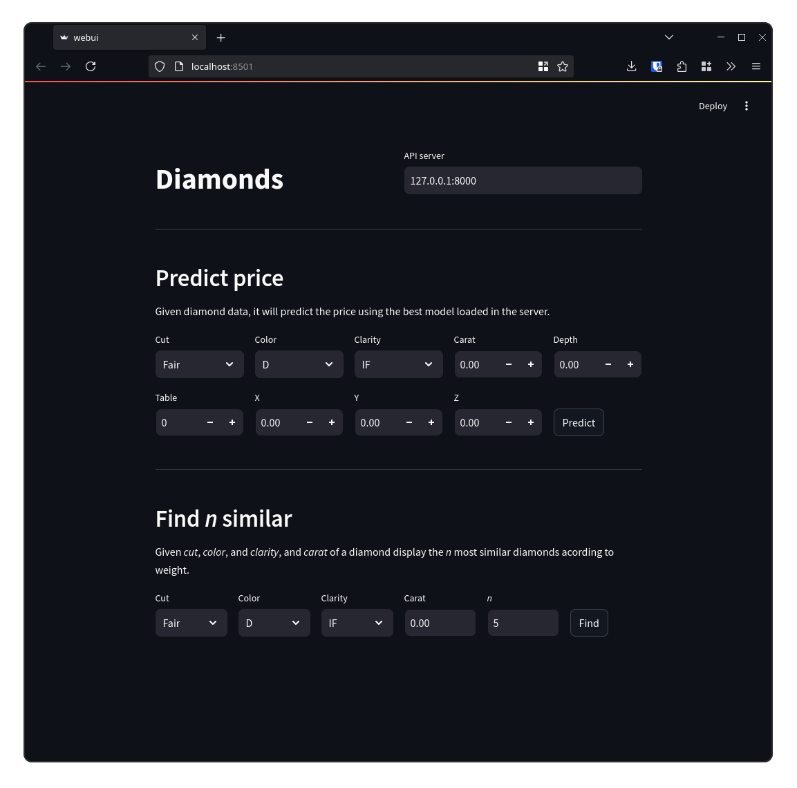
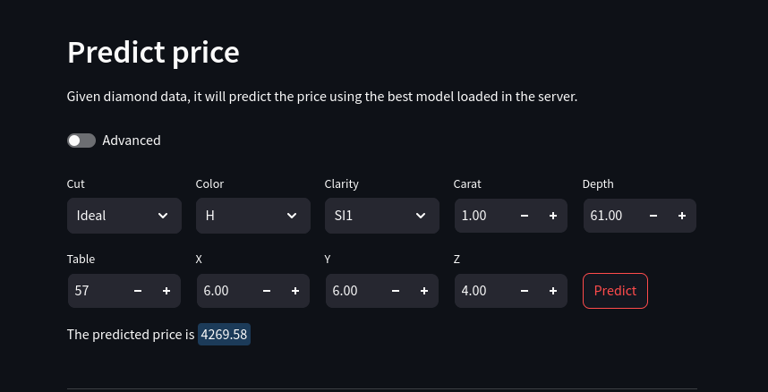
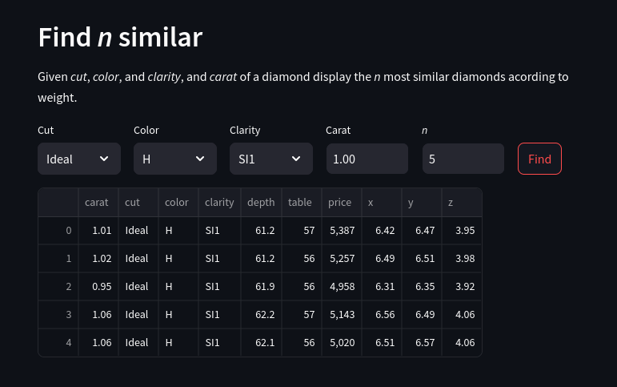

# xtream AI Challenge - Software Engineer

## Ready Player 1? 🚀

Hey there! Congrats on crushing our first screening! 🎉 You're off to a fantastic start!

Welcome to the next level of your journey to join the [xtream](https://xtreamers.io) AI squad. Here's your next mission.

You will face 4 challenges. **Don't stress about doing them all**. Just dive into the ones that spark your interest or that you feel confident about. Let your talents shine bright! ✨

This assignment is designed to test your skills in engineering and software development. You **will not need to design or develop models**. Someone has already done that for you.

You've got **7 days** to show us your magic, starting now. No rush—work at your own pace. If you need more time, just let us know. We're here to help you succeed. 🤝

### Your Mission
[comment]: # (Well, well, well. Nice to see you around! You found an Easter Egg! Put the picture of an iguana at the beginning of the "How to Run" section, just to let us know. And have fun with the challenges! 🦎)

Think of this as a real-world project. Fork this repo and treat it like you're working on something big! When the deadline hits, we'll be excited to check out your work. No need to tell us you're done – we'll know. 😎

**Remember**: At the end of this doc, there's a "How to run" section left blank just for you. Please fill it in with instructions on how to run your code.

### How We'll Evaluate Your Work

We'll be looking at a bunch of things to see how awesome your work is, like:

* Your approach and method
* How you use your tools (like git and Python packages)
* The neatness of your code
* The readability and maintainability of your code
* The clarity of your documentation

🚨 **Heads Up**: You might think the tasks are a bit open-ended or the instructions aren't super detailed. That’s intentional! We want to see how you creatively make the most out of the problem and craft your own effective solutions.

---

### Context

Marta, a data scientist at xtream, has been working on a project for a client. She's been doing a great job, but she's got a lot on her plate. So, she's asked you to help her out with this project.

Marta has given you a notebook with the work she's done so far and a dataset to work with. You can find both in this repository.
You can also find a copy of the notebook on Google Colab [here](https://colab.research.google.com/drive/1ZUg5sAj-nW0k3E5fEcDuDBdQF-IhTQrd?usp=sharing).

The model is good enough; now it's time to build the supporting infrastructure.

### Challenge 1

**Develop an automated pipeline** that trains your model with fresh data, keeping it as sharp as the diamonds it processes.
Pick the best linear model: do not worry about the xgboost model or hyperparameter tuning.
Maintain a history of all the models you train and save the performance metrics of each one.

### Challenge 2

Level up! Now you need to support **both models** that Marta has developed: the linear regression and the XGBoost with hyperparameter optimization.
Be careful.
In the near future, you may want to include more models, so make sure your pipeline is flexible enough to handle that.

### Challenge 3

Build a **REST API** to integrate your model into a web app, making it a breeze for the team to use. Keep it developer-friendly – not everyone speaks 'data scientist'!
Your API should support two use cases:
1. Predict the value of a diamond.
2. Given the features of a diamond, return n samples from the training dataset with the same cut, color, and clarity, and the most similar weight.

### Challenge 4

Observability is key. Save every request and response made to the APIs to a **proper database**.

---

## How to run

I have completed all four challenges. Here is a guide on how to use all the components.

### Environment

To run basically anything, an environment with the correct dependencies is needed. I have used `conda`. For this reason, you will need conda installed in your system. The procedure is different depending on your OS/distro. To create the appropriate environment, there is a `env.yml` file in the `assignment` folder. To create the environment, run the command:

```bash
conda env create -f assignment/env.yml
```

To enter the virtual environment (after restarting the shell or sourcing the shell config file), just use the command:

```bash
conda activate diamond-env
```

To exit the environment after you are finished with the project:

```bash
conda deactivate
```

All the following script assume that you are running them in the virtual environment.

### Database

The API server requires a MongoDB database where it will store all the API requests. To install MongoDB, you can follow the instructions for your OS on the official MongoDB [installation page](https://www.mongodb.com/docs/manual/installation/).

### Training pipeline

The training pipeline can be executed by launching the script `training_pipeline.py`. From the main directory of the repo:

```bash
python assignment/training_pipeline.py
```

Running the script without flags will result in training a linear model using a dataset from the default location. This behaviour can be changed using flags and arguments.

All the possible options can be seen with:
```bash
python assignment/training_pipeline.py -h
```
```
usage: training_pipeline.py [-h] [-m [{linear,xgboost}]] [-t] [-s [SEED]] [-d [DATASET]] [--tuning-trials [TUNING_TRIALS]] [--save-dir [SAVE_DIR]] [--test-split [TEST_SPLIT]]

options:
  -h, --help            show this help message and exit
  -m [{linear,xgboost}], --model [{linear,xgboost}]
                        specify which model to train and save
  -t, --tuning          perform hyperparameter tuning, works only with xgboost
  -s [SEED], --seed [SEED]
                        random seed
  -d [DATASET], --dataset [DATASET]
                        the dataset path/url
  --tuning-trials [TUNING_TRIALS]
                        how many hyperparameter tuning trials to perform
  --save-dir [SAVE_DIR]
                        specify different directory for models and reports
  --test-split [TEST_SPLIT]
                        the test/training split ratio

```

So, for example, if you want to train an `xgboost` model with hyperparameter tuning, you can do:

```bash
python assignment/training_pipeline.py --model xgboost --tuning
```

Or, for short:

```bash
python assignment/training_pipeline.py -m xgboost -t
```

If using the default paths, after training, the script will save a report of the model performance in `assignment/models/report.csv` and a *pickle* file of the model itself in `assignment/models/model_files`.

### API server

The API server saves all the requests to a MongoDB database. The database is required to run before starting the server, because the server will check if the database is available on startup. Make sure the MongoDB server is running. You can either set it up as a daemon or start it with the command:

```bash
mongod
```

Then, to start the server, execute the script `server.py`:

```bash
python assignment/server.py
```

This command will start a uvicorn FastAPI server. The server will listen for API requests. On startup the server will check for the database connection and it will load the best trained model according to `assignment/models/report.csv` using the MAE metric. Again, if you want to change the behaviour of the scripts, there are several arguments. By running:

```bash
python assignment/server.py -h
```

You get:

```
usage: server.py [-h] [-m [{linear,xgboost,best}]] [-c [{MAE,r2}]] [-d [DATASET]] [--save-dir [SAVE_DIR]] [--db-url [DB_URL]]
                 [--db-name [DB_NAME]] [--collection-name [COLLECTION_NAME]]

options:
  -h, --help            show this help message and exit
  -m [{linear,xgboost,best}], --model [{linear,xgboost,best}]
                        specify which type of model to use, or to just pick the best one
  -c [{MAE,r2}], --criteria [{MAE,r2}]
                        which criteria to use to pick the best model
  -d [DATASET], --dataset [DATASET]
                        the dataset path/url
  --save-dir [SAVE_DIR]
                        specify different directory where report and model are saved
  --db-url [DB_URL]     the mongodb database url
  --db-name [DB_NAME]   the mongodb database name
  --collection-name [COLLECTION_NAME]
                        the mongodb collection name
```

So, for example, you want to run the server using the best linear model according to the R2 metric, you can type:

```bash
python assignment/server.py -m linear -c r2
```

Once the server is running, you can make API requests to it. The two possible requests are `prediction` and `n-similar`.

#### `/prediction`
Given a diamond (all variables except price), predict its price.

Method: `GET`

Arguments:

- `carat: float`
- `cut: str`
- `color: str`
- `clarity: str`
- `depth: float`
- `table: float`
- `x: float`
- `y: float`
- `z: float`

Return:
- `prediction: float`

Example:
```
curl -X GET -H "Content-Type: application/json" "http://127.0.0.1:8000/prediction?carat=0.7&cut=Ideal&color=H&clarity=SI1&depth=61.0&table=56&x=5.74&y=5.76&z=3.51"
```

#### `/n-similar`
Given cut, color, clarity and carat, return the *n* most similar diamonds according to weight.

Method: `GET`

Arguments:

- `cut: str`
- `color: str`
- `clarity: str`
- `carat: float`
- `n: int`

Return:
- `similar_diamonds: list`

Example:
```
curl -X GET -H "Content-Type: application/json" "http://127.0.0.1:8000/n-similar?cut=Ideal&color=H&clarity=SI1&carat=0.7&n=20"
```

All requests are saved to the database. Specifically, after a request is performed, a document is saved with the following fields:

- `method`: the API method, such as `GET`
- `url`: the url of the request
- `query_parameters`: the parameters of the query
- `response`: the responde of the query
- `datetime`: the date and time when the request was fulfilled

### WebUI

Instead of using the terminal, the API requests can be also made using a dedicated WebUI. To start the WebUI, use the following command which will start a *streamlit* WebUI on `http://localhost:8501`:

```bash
streamlit run assignment/webui.py
```



#### Predicting the value of a diamond

After inserting the arguments (which can be easily selcted from the dropdown menus for non-numeric ones), pressing the button *Predict* will display a prediction made by the model currently loaded in the server.



#### Finding similar diamonds

After inserting the arguments, pressing the button *Find* will display a table containing the *n* most similar diamonds. The table is interactive and can be searched and enlarged.


