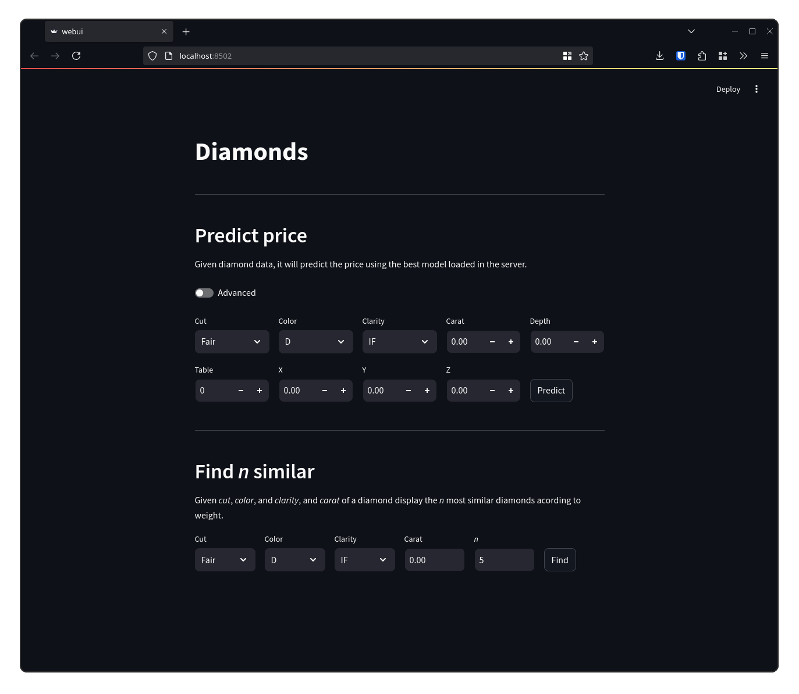
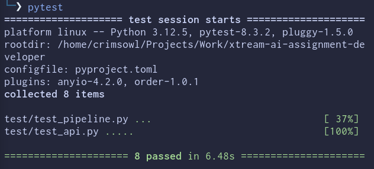

# xtream AI Challenge - Software Engineer

## Ready Player 1? 🚀

Hey there! Congrats on crushing our first screening! 🎉 You're off to a fantastic start!

Welcome to the next level of your journey to join the [xtream](https://xtreamers.io) AI squad. Here's your next mission.

You will face 4 challenges. **Don't stress about doing them all**. Just dive into the ones that spark your interest or that you feel confident about. Let your talents shine bright! ✨

This assignment is designed to test your skills in engineering and software development. You **will not need to design or develop models**. Someone has already done that for you.

You've got **7 days** to show us your magic, starting now. No rush—work at your own pace. If you need more time, just let us know. We're here to help you succeed. 🤝

### Your Mission
[comment]: # (Well, well, well. Nice to see you around! You found an Easter Egg! Put the picture of an iguana at the beginning of the "How to Run" section, just to let us know. And have fun with the challenges! 🦎)

Think of this as a real-world project. Fork this repo and treat it like you're working on something big! When the deadline hits, we'll be excited to check out your work. No need to tell us you're done – we'll know. 😎

**Remember**: At the end of this doc, there's a "How to run" section left blank just for you. Please fill it in with instructions on how to run your code.

### How We'll Evaluate Your Work

We'll be looking at a bunch of things to see how awesome your work is, like:

* Your approach and method
* How you use your tools (like git and Python packages)
* The neatness of your code
* The readability and maintainability of your code
* The clarity of your documentation

🚨 **Heads Up**: You might think the tasks are a bit open-ended or the instructions aren't super detailed. That’s intentional! We want to see how you creatively make the most out of the problem and craft your own effective solutions.

---

### Context

Marta, a data scientist at xtream, has been working on a project for a client. She's been doing a great job, but she's got a lot on her plate. So, she's asked you to help her out with this project.

Marta has given you a notebook with the work she's done so far and a dataset to work with. You can find both in this repository.
You can also find a copy of the notebook on Google Colab [here](https://colab.research.google.com/drive/1ZUg5sAj-nW0k3E5fEcDuDBdQF-IhTQrd?usp=sharing).

The model is good enough; now it's time to build the supporting infrastructure.

### Challenge 1

**Develop an automated pipeline** that trains your model with fresh data, keeping it as sharp as the diamonds it processes.
Pick the best linear model: do not worry about the xgboost model or hyperparameter tuning.
Maintain a history of all the models you train and save the performance metrics of each one.

### Challenge 2

Level up! Now you need to support **both models** that Marta has developed: the linear regression and the XGBoost with hyperparameter optimization.
Be careful.
In the near future, you may want to include more models, so make sure your pipeline is flexible enough to handle that.

### Challenge 3

Build a **REST API** to integrate your model into a web app, making it a breeze for the team to use. Keep it developer-friendly – not everyone speaks 'data scientist'!
Your API should support two use cases:
1. Predict the value of a diamond.
2. Given the features of a diamond, return n samples from the training dataset with the same cut, color, and clarity, and the most similar weight.

### Challenge 4

Observability is key. Save every request and response made to the APIs to a **proper database**.

---

## How to run

I have completed all four challenges. Here is a guide on how to use all the components.

### Preliminary setup

#### Environment

To run basically anything in this repo, an environment with the correct dependencies is needed. I have used `conda`. For this reason, you will need conda installed in your system. The procedure is different depending on your OS/distro. You can find more information on the official [installation page](https://conda.io/projects/conda/en/latest/user-guide/install/index.html).

To create the appropriate environment, there is a `conda_env.yml` file which will create the right environment with the correct dependencies named `diamond-env`. To create the environment, run the command:

```bash
$ conda env create -f conda_env.yml
```

To enter the virtual environment (it may be necessary to restart the shell or source the shell config file) just use the command:

```bash
$ conda activate diamond-env
```

All the scripts require the virtual environment to be active.

Additionally, all the important constants in the project are saved in the `.env` file. The file contains:

```env
DATASET_PATH = "https://raw.githubusercontent.com/xtreamsrl/xtream-ai-assignment-engineer/main/datasets/diamonds/diamonds.csv"
MODEL_DIR_PATH = "models"
API_SERVER_URL = "127.0.0.1:8000"
DB_URL = "mongodb://localhost:27017/"
DB_NAME = "diamond_db"
DB_COLLECTION = "api_requests"
```

#### Database

The API server requires a MongoDB database where it will store all the API requests. To install MongoDB, you can follow the instructions for your OS on the official MongoDB [installation page](https://www.mongodb.com/docs/manual/installation/).

The database URL, name and collection are all specified in the environment file mentioned above and can be edited accordingly.

### Training pipeline

To make the training pipeline as user friendly and as extensible as possible, it can be entirely defined in `yml` files. Three example are stored in the `pipelines` directory, which define the three different approaches shown in `notebooks/MP01_Diamonds_Modelling.ipynb`: linear regression, XGBoost and XGBoost with hyperparameter tuning.

The top level structure of the yaml pipeline is the following:

```yaml
name: # Mandatory
module: # Mandatory
class: # Mandatory
seed: # Optional
model_kwargs: # Optional
pipeline: # Optional
hyperparameter_tuning: # Optional
```

#### Top level fields

There are three mandatory fields to put in the file:
- `name`: the name of the model type or approach, which will be used when saving and loading the models to identify models of the same category
- `module`: the name of the python module that contains the model's class
- `class`: the class of the models itself. The model class must support the `.fit()` method for training and `.predict()` method for inference

We have additional fields, which are not mandatory:
- `seed`: specify which random seed to use
- `model_kwargs`: keyword arguments that will be passed to the model class when creating the model itself

    Example:
    ```yaml
    model_kwargs:
        enable_categorical: True
        random_state: 42
    ```

All of the fields mentioned up until now define the general characteristics of the model and how to instantiate it. An example would be:
```yaml
name: linear
module: sklearn.linear_model
class: LinearRegression
seed: 42
```

#### Data pipeline

Under the field `pipeline`, it is possible to specify how the data is preprocessed before feeding it into the model. The pipeline assumes that the dataset is an instance of a `pandas` `DataFrame`.

```yaml
pipeline:
    # Objects
```

The possible objects are:

- `drop`: specify a list of columns to drop from the dataframe

    Example:
    ```yaml
    drop:
        - depth
        - table
        - y
        - z
    ```
    Or, more compactly:
    ```yaml
    drop: [depth, table, y, z]
    ```

- `dummies`: whether to create dummy variables. It has two subfields:
    - `columns`: a list of the variables from which the pipeline will create dummies
    - `drop_first`: specify if the `drop_first` argument of the function `pandas.get_dummies` should be `True/False`

    Example:
    ```yaml
    dummies:
        columns: [cut, color, clarity]
        drop_first: True
    ```

- `categorical`: specify a list of variables to convert to categorical variables. Every variable is defined as an object with the following fields:
    - `variable`: the name of the variable to convert to categorical
    - `categories`: a list of the different categories
    - `ordered`: the `ordered` parameter to pass to the `pandas.Categorical` function

    Example:
    ```yaml
    categorical:
        - variable: cut
            categories: [Fair, Good, Very Good, Ideal, Premium]
            ordered: True
        - variable: color
            categories: [D, E, F, G, H, I, J]
            ordered: True
    ```

- `target`: the target variable, which will be removed from the X data and used as Y data
- `test_split`: the ratio of test samples compared to the training samples when splitting the dataset. If not specified, the default will be 0.2

#### Hyperparameter tuning

Additionally, hyperparameter tuning performed with `optuna` can be specified in the `hyperparameter_tuning` object. The fields are:
- `n_trials`: how many hyperparameter tuning trials to perform
- `test_split`: the test split ratio when performing the tuning
- `params`: specify the parameters to optimize and other arguments to pass to the model. Each parameter has the following structure:

    ```yaml
    parameter_name:
        trial: # The Trial class function such as suggest_float
        args: # A list of arguments to pass to the trial function (both args and kwargs)
    ```

    Example:

    ```yaml
    lambda:
        trial: suggest_float
        args:
            - lambda
            - 0.00000001
            - 1.0
            - log: True
    ```

    It is possible to specify additional keyword arguments under `params` that will be passed to the model, for example:

    ```yaml
    enable_categorical: True
    random_state: 42
    ```

    Putting together the examples:

    ```yaml
    hyperpamater_tuning:
        n_trials: 100
        test_split: 0.2
        params:
            lambda:
                trial: suggest_float
                args:
                    - lambda
                    - 0.00000001
                    - 1.0
                    - log: True
            enable_categorical: True
            random_state: 42
    ```

#### Complete pipeline examples

The following is an example of the linear regression pipeline shown in `notebooks/MP01_Diamonds_Modelling.ipynb`:
```yaml
name: linear
module: sklearn.linear_model
class: LinearRegression
seed: 42
pipeline:
    drop: [depth, table, y, z]
    dummies:
        columns: [cut, color, clarity]
        drop_first: True

    target: price
    test_split: 0.2
```

The following is the XGBoost pipeline shown in the same notebook, with hyperparameter tuning:

```yaml
name: xgboost
module: xgboost
class: XGBRegressor
seed: &seed 42
model_kwargs:
  enable_categorical: True
  random_state: *seed

pipeline:
    categorical:

        - variable: cut
            categories: [Fair, Good, Very Good, Ideal, Premium]
            ordered: True

        - variable: color
            categories: [D, E, F, G, H, I, J]
            ordered: True

        - variable: clarity
            categories: [IF, VVS1, VVS2, VS1, VS2, SI1, SI2, I1]
            ordered: True

    target: price
    test_split: 0.2

hyperparameter_tuning:
    n_trials: 100
    test_split: 0.2
    params:
        lambda:
            trial: suggest_float
            args:
                - lambda
                - 0.00000001
                - 1.0
                - log: True
        alpha:
            trial: suggest_float
            args:
                - alpha
                - 0.00000001
                - 1.0
                - log: True
        colsample_bytree:
            trial: suggest_categorical
            args:
                - colsample_bytree
                - [0.3, 0.4, 0.5, 0.7]
        subsample:
            trial: suggest_categorical
            args:
                - subsample
                - [0.5, 0.6, 0.7, 0.8, 0.9, 1.0]
        learning_rate:
            trial: suggest_float
            args:
                - learning_rate
                - 0.00000001
                - 1.0
                - log: True
        n_estimators:
            trial: suggest_int
            args:
                - n_estimators
                - 100
                - 1000
        max_depth:
            trial: suggest_int
            args:
                - max_depth
                - 3
                - 9
        min_child_weight:
            trial: suggest_int
            args:
                - min_child_weight
                - 1
                - 10
        enable_categorical: True
        random_state: *seed
```

#### Running the pipeline

The training pipeline can be executed by launching the script `run_pipeline.py`. It is mandatory to pass the argument `-p`/`--pipeline` to specify the path of the pipeline to use. For example, from the top level of this repo:

```bash
$ python run_pipeline.py -p pipelines/linear.yml
```

Running this script will result in training the model specified in the `linear.yml` file using the defined data pipeline.

If using the default paths specified in `.env`, after training, the script will save a report of the model performance in `models/report.csv` and a *pickle* file of the model itself in `models/model_files`.

### API server

The API server saves all the requests to a MongoDB database. The database is required to run before starting the server, because the server will check if the database is available on startup. Make sure the MongoDB server is running. You can either set it up as a daemon or start it with the command:

```bash
$ mongod
```

Then, to start the server, execute the script `server.py`:

```bash
$ python server.py
```

This command will start a uvicorn FastAPI server. The server will listen for API requests. On startup the server will check for the database connection.

The script has an optional argument: `-e`/`--env-path`.
By default, the server will use the `.env` file as environment, but it is possible to use a custom environment file using the argument discussed above:

```bash
$ python server.py -e path/to/custom/env
```

This can be useful for testing. More about testing later in the readme.

Once the server is running, you can make API requests to it. The two possible requests are `prediction` and `similar`.

#### `/prediction`
Given a diamond (all variables except price), predict its price. The server will use the best model of the specified kind to fulfill the request.

Method: `POST`

Parameters:

- `carat: float`
- `cut: str`
- `color: str`
- `clarity: str`
- `depth: float`
- `table: float`
- `x: float`
- `y: float`
- `z: float`
- `model: str`: which type of model to use for the prediction among `linear`, `xgboost` or `best`. Default is `best`.
- `criteria: str`: which criteria to use to select the model among `mae` and `r2`. Default is `mae`.

Return:
- `prediction: float`

If there are no trained models in the server, or if there are no trained models of the specified type, the server will return a response with a status code of 404 and a detailed message about what the problem is.

NOTE: to keep it as developer friendly as possible, `model` and `criteria` have default values and can be omitted.

Example:

```
$ curl -X GET -H "Content-Type: application/json"\
    "http://127.0.0.1:8000/prediction?carat=0.7&cut=Ideal&color=H&clarity=SI1&depth=61.0&table=56&x=5.74&y=5.76&z=3.51"
```

#### `/similar`
Given cut, color, clarity and carat, return the *n* most similar diamonds according to weight with the same cut, color and clarity.

Method: `POST`

Parameters:

- `cut: str`
- `color: str`
- `clarity: str`
- `carat: float`
- `n: int`

Return:
- `similar_diamonds: list`

Example:
```
$ curl -X POST -H "Content-Type: application/json"\
    "http://127.0.0.1:8000/n-similar?cut=Ideal&color=H&clarity=SI1&carat=0.7&n=20"
```

All API requests are saved to the database. Specifically, after a request is performed, a document is saved in the database with the following fields:

- `method`: the API method, such as `POST`
- `url`: the url of the request
- `path`: the path of the request, such as `/similar`
- `query_parameters`: the parameters of the query
- `response`: the responde of the query
- `datetime`: the date and time when the request was fulfilled

### WebUI

Instead of using the terminal or another application, the API requests can be also made using a dedicated WebUI. To start the WebUI, use the following command which will start a *streamlit* WebUI on `http://localhost:8501`:

```bash
$ streamlit run webui.py
```



#### Predicting the value of a diamond

After inserting the arguments (which can be easily selected from the dropdown menus for non-numeric ones), pressing the button *Predict* will display a prediction made by the model currently loaded in the server.


More advanced technical options like the model type and the criteria to choose the best model are hidden behind the `advanced` toggle, to avoid confusion for those who are less technical.


#### Finding similar diamonds

After inserting the arguments, pressing the button *Find* will display a table containing the *n* most similar diamonds. The table is interactive and can be searched and enlarged.


### Testing

The repo contains some tests in the folder `test` that can be easily run using `pytest`. The components being tested are:

- **model training pipeline**: it will test all three pipelines defined in `test/test_pipelines`, namely linear regression, XGBoost and XGBoost with hyperparameter tuning
 and the APIs, checking if they output the correct response, both in functioning cases and in situations where the server cannot find a model to fulfill the request. It will train and save models in the `test/test_models` folder (which will be deleted after the test).

- **APIs**: it will test and check if the API requests to the server output the correct response, both in functioning cases and in situations where the server cannot find a model to fulfill the request. Additionally, it will ensure that every request is saved to the database.


The testing makes use of a custom environment file (`test/.env.test`) that specifies a different model save directory and a different database in order not to affect the main database. The content of the file is:

```env
DATASET_PATH = "https://raw.githubusercontent.com/xtreamsrl/xtream-ai-assignment-engineer/main/datasets/diamonds/diamonds.csv"
MODEL_DIR_PATH = "test/test_models"
API_SERVER_URL = "127.0.0.1:8000"
DB_URL = "mongodb://localhost:27017/"
DB_NAME = "test_diamond_db"
DB_COLLECTION = "api_requests"
```

There are also three specified pipelines in `test/test_pipelines` which will be used to test the training pipelines. As of right now, the test pipelines are identical to the normal pipelines with the only difference that less hyperparameter tuning trials are performed.

To run the test, two things are required:
1. The conda environment `diamond-env` must be active
2. The `server.py` script must be running using the custom environment

So, these are the commands to correctly set everything up and test:

```bash
$ conda activate diamond-env
$ python server.py -e test/.env.test
$ pytest
```

If everything is set up correctly the code should pass all tests.

